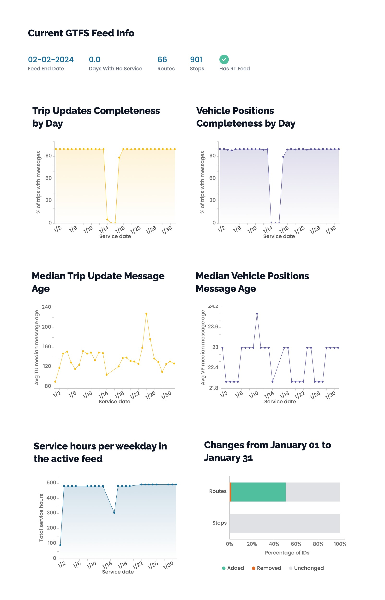
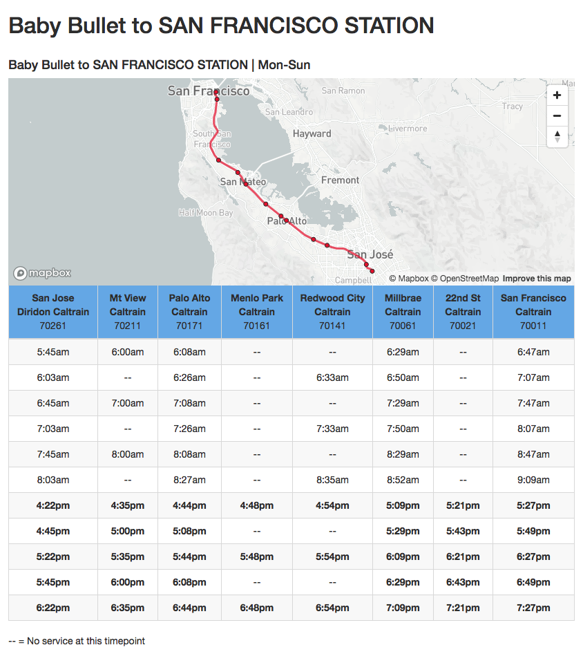
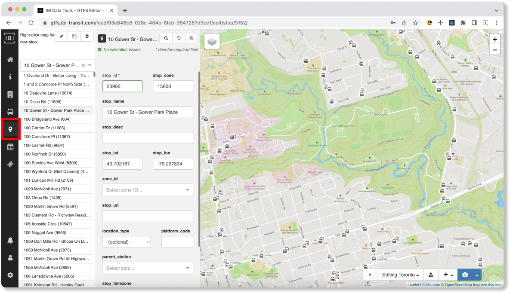
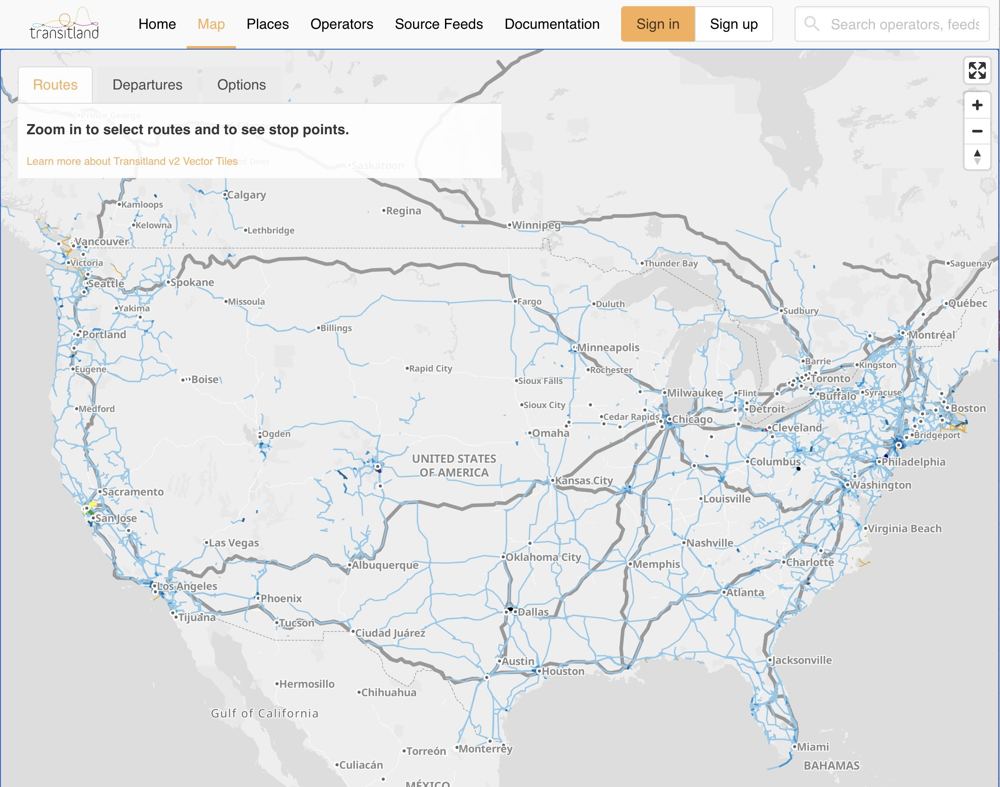
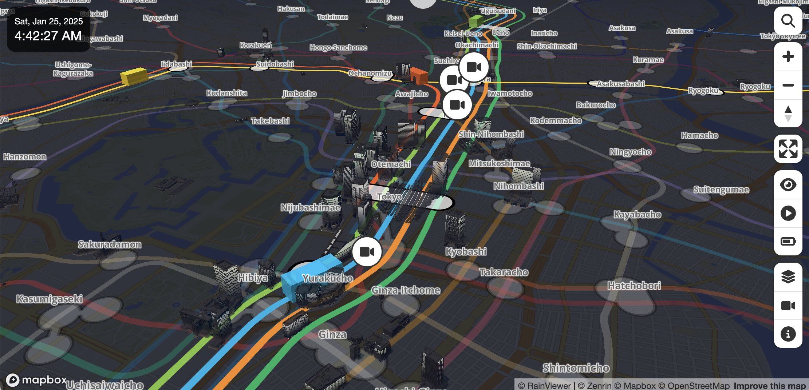
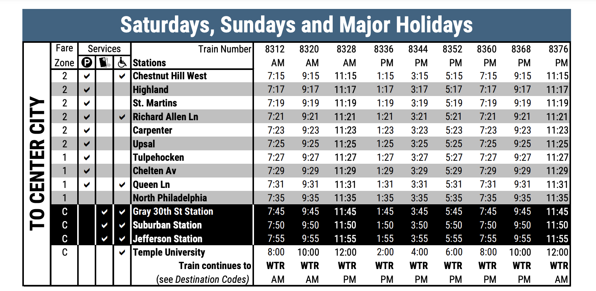

# Posit workweek 2025 Tiny Transit Hackathon

The Tiny Transit Hackathon is a 3 hour event focused on learning about
public transit, and exploring open source transit data. It will take
place on Tues, Feb 4th of Posit’s annual company work week. Any Posit
folks there (in-person or virtually) are welcome to join!

## Public transit data and standards

- [**GTFS
  schedules**](https://gtfs.org/documentation/schedule/reference/):
  represent transit schedules, fares, stop locations, and transfer
  options.
- [**GTFS realtime
  (RT)**](https://gtfs.org/documentation/realtime/reference/): represent
  realtime vehicle location and trip updates.
- [**TIDES**](https://github.com/TIDES-transit/TIDES): (work in
  progress) represent vehicle location, passenger count, and fare
  transaction data.
  - We’ll have “TIDES-like” automatic vehicle location (AVL) with block
    and stop data, and automatic passenger counts (APC) data provided by
    a transit agency.

## Example reports and dashboards

<table>
<thead>
<tr>
<th>
name
</th>
<th>
description
</th>
</tr>
</thead>
<tr>
<td>
<a href="https://reports.calitp.org/gtfs_schedule/2024/01/208/">cal-itp
monthly GTFS quailty report</a>
</td>
<td>
Monthly reporting on GTFS schedules and realtime data in California.
</td>
</tr>
<tr>
<td colspan="2">

preview

</td>
</tr>
<tr>
<td>
<a href="https://github.com/BlinkTagInc/gtfs-to-html">gtfs-to-html</a>
</td>
<td>
Generate timetables and maps from GTFS schedules.
</td>
</tr>
<tr>
<td colspan="2">

preview

</td>
</tr>
<tr>
<td>
<a href="https://github.com/ibi-group/datatools-ui">datatools-ui</a>
</td>
<td>
Application to edit GTFS schedule data.
</td>
</tr>
<tr>
<td colspan="2">

preview

</td>
</tr>
<tr>
<td>
<a href="https://www.transit.land/map">transitland map</a>
</td>
<td>
Map of schedule data around the world. Has links to schedule feeds.
</td>
</tr>
<tr>
<td colspan="2">

preview

</td>
</tr>
<tr>
<td>
<a href="https://minitokyo3d.com/">mini tokyo 3d</a>
</td>
<td>
3D map of Tokyo transit system.
</td>
</tr>
<tr>
<td colspan="2">

preview

</td>
</tr>
</table>

## Resources

- [awesome-gtfs](https://github.com/andredarcie/awesome-gtfs)
- [python: gtfs-kit](https://github.com/mrcagney/gtfs_kit)
- [R: tidytransit](https://github.com/r-transit/tidytransit)

Reading:

- [Reece Martin transit blog](https://reecemartin.ca/table-of-contents/)

## Potential projects: What could you work on?

| Project Idea | Description |
|----|----|
| GTFS route timetables | Timetables are an incredible use of tables, with a long history. Let’s explore their design with Great Tables (or other tools). |
| Method for connecting realtime data to stops | GTFS realtime data just says a vehicle’s lattitude and longitude. How can we connect that to scheduled stops? |
| Shiny dashboard for updating GTFS schedules | For updating routes, trips, and stops, etc.. |
| Shiny dashboard for mapping realtime vehicle positions | Fixing [this shiny app](https://shiny.posit.co/r/gallery/interactive-visualizations/bus-dashboard/). |
| Metro Transit travel time and passenger count dashboard | Creating reports and dashboards for mapping vehicle data based on stop segments. |

### GTFS route timetables and trip map

Have you seen transit timetables? They are a great example of table
design! Join table design wizard and [Great
Tables](https://github.com/posit-dev/great-tables) creator Rich Iannone
for a deep dive into the design and creation of these beauties:

It would be neat to recreate tables like above in Great Tables. For
bonus we could create a map of the route and stops (similar to
gtfs-to-html).

### Shiny dashboard for updating GTFS schedules

Working on an application to update GTFS schedules is a good way to get
a feel for its underlying data model of transit networks. It would be
neat to see what a Shiny app, similar to
[datatools-ui](https://github.com/ibi-group/datatools-ui) might look
like.

### Shiny dashboard for mapping realtime vehicle positions

Uh-oh. Our [bus
dashboard](https://shiny.posit.co/r/gallery/interactive-visualizations/bus-dashboard/)
showing realtime vehicle positions of some buses in Metro Transit is
broken. Can you fix it?!

Here’s another example of a bus dashboard:

- https://forum.posit.co/t/dude-wheres-my-bus-2020-shiny-contest-submission/56634

### Methods for connecting realtime data to stops

> [!IMPORTANT]
>
> Preparing this is a work in progress.

Tiffany Ku at Caltrans is working on connecting realtime vehicle data to
stops. There is a demo repo here:

- https://github.com/tiffanychu90/gtfs-rt-demo

Key pieces you could work on are detailed in this issue:

- https://github.com/machow/transit-data-analyses/issues/1

### Metro Transit travel time and passenger count dashboard

> [!IMPORTANT]
>
> Preparing this is a work in progress.

We’ll have vehicle location and passenger count data at the hackathon.
Some potential questions folks could answer are:

- Vehicle load mapped by stop-segment
- Passenger arrival rates for each stop or route-stop (through-out the
  day, by service type), lots of way to aggregate or slice and dice.
- Probability of stopping for passenger activity by stop
- Dwell-time modeling (based on boardings and alightings)
- Boarding and alighting relative to station area population and job
  density
