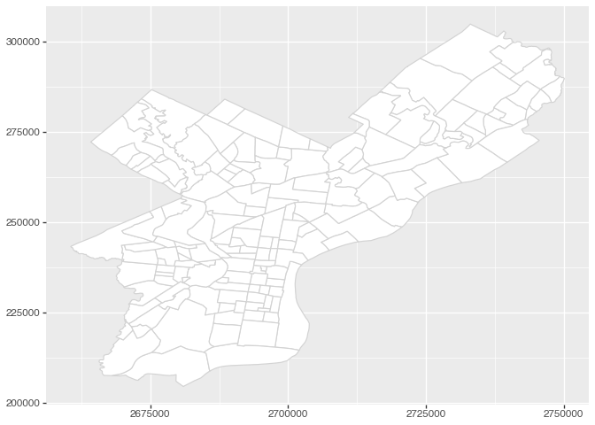
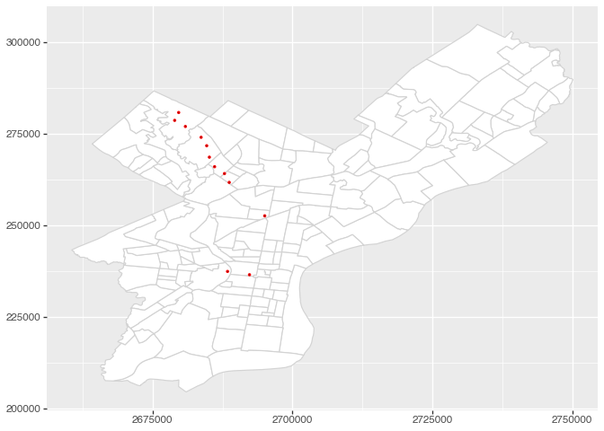

# Great Transit Time Tables


For this analysis, we’ll pull out the data for the timetble below, using
Septa rail GTFS schedules.


Notice that the rows are station stops, and the columns are train
numbers (specific trips). While this is a super convenient table, it is
a bit tricky to extract from GTFS data.

## Read in GTFS schedule data

``` python
import polars as pl
import polars_st as st

trips = pl.read_csv("septa-gtfs-rail/trips.txt")
stop_times = pl.read_csv("septa-gtfs-rail/stop_times.txt")
stops = pl.read_csv("septa-gtfs-rail/stops.txt")

calendar = pl.read_csv("septa-gtfs-rail/calendar.txt")
calendar_dates = pl.read_csv("septa-gtfs-rail/calendar_dates.txt")
```

``` python
trips.filter(pl.col("route_id") == "CHW").select("route_id", "service_id", "trip_id")
```

<div><style>
.dataframe > thead > tr,
.dataframe > tbody > tr {
  text-align: right;
  white-space: pre-wrap;
}
</style>
<small>shape: (93, 3)</small>

| route_id | service_id | trip_id          |
|----------|------------|------------------|
| str      | str        | str              |
| "CHW"    | "M1"       | "CHW_809_V55_M"  |
| "CHW"    | "M1"       | "CHW_9847_V55_M" |
| "CHW"    | "M3"       | "CHW_8352_V14_M" |
| "CHW"    | "M1"       | "CHW_8338_V55_M" |
| "CHW"    | "M1"       | "CHW_9819_V55_M" |
| …        | …          | …                |
| "CHW"    | "M2"       | "CHW_8352_V13_M" |
| "CHW"    | "X1"       | "CHW_3807_V3_M"  |
| "CHW"    | "M1"       | "CHW_9826_V55_M" |
| "CHW"    | "X1"       | "CHW_8352_V3_M"  |
| "CHW"    | "M2"       | "CHW_3807_V13_M" |

</div>

Each row of the table above could be one of the columns of our
timetable. It’s a specific time of day a route might run.

`service_id` links to the calendar table, which tells whether it runs on
a given day:

``` python
calendar
```

<div><style>
.dataframe > thead > tr,
.dataframe > tbody > tr {
  text-align: right;
  white-space: pre-wrap;
}
</style>
<small>shape: (5, 10)</small>

| service_id | monday | tuesday | wednesday | thursday | friday | saturday | sunday | start_date | end_date |
|----|----|----|----|----|----|----|----|----|----|
| str | i64 | i64 | i64 | i64 | i64 | i64 | i64 | i64 | i64 |
| "M1" | 1 | 1 | 1 | 1 | 1 | 0 | 0 | 20241222 | 20250308 |
| "M2" | 0 | 0 | 0 | 0 | 0 | 1 | 0 | 20241222 | 20250308 |
| "M3" | 0 | 0 | 0 | 0 | 0 | 0 | 1 | 20241222 | 20250308 |
| "X1" | 0 | 0 | 1 | 0 | 0 | 0 | 0 | 20241225 | 20241225 |
| "N1" | 0 | 1 | 0 | 0 | 0 | 0 | 0 | 20241231 | 20241231 |

</div>

Notice that the rows in calendar roughly correspond to whether its
weekday service, weekend service, or two for weekend couple, or some
special ones.

## Joining trips to stops

The best way to illustrate this is to join trips, stop_times, and stops.
This gives you a table that shows you each stop a trip makes (and its
arrival time).

``` python
tbl_trip_stops = trips.join(stop_times, "trip_id").join(stops, "stop_id")
chw_trip_stops = tbl_trip_stops.filter(pl.col("route_id") == "CHW")

chw_trip_stops
```

<div><style>
.dataframe > thead > tr,
.dataframe > tbody > tr {
  text-align: right;
  white-space: pre-wrap;
}
</style>
<small>shape: (1_168, 20)</small>

| route_id | service_id | trip_id | trip_headsign | block_id | trip_short_name | shape_id | direction_id | arrival_time | departure_time | stop_id | stop_sequence | pickup_type | drop_off_type | stop_name | stop_desc | stop_lat | stop_lon | zone_id | stop_url |
|----|----|----|----|----|----|----|----|----|----|----|----|----|----|----|----|----|----|----|----|
| str | str | str | str | i64 | i64 | i64 | i64 | str | str | i64 | i64 | i64 | i64 | str | str | f64 | f64 | str | str |
| "CHW" | "M1" | "CHW_2809_V43_M" | "Chestnut Hill West" | 2809 | 2809 | 5801 | 1 | "08:47:00" | "08:47:00" | 90005 | 29 | 0 | 0 | "Suburban Station" | null | 39.953889 | -75.167778 | "CC" | null |
| "CHW" | "M1" | "CHW_2809_V43_M" | "Chestnut Hill West" | 2809 | 2809 | 5801 | 1 | "08:52:00" | "08:52:00" | 90004 | 33 | 0 | 0 | "Gray 30th Street" | null | 39.956667 | -75.181667 | "CC" | null |
| "CHW" | "M1" | "CHW_2809_V43_M" | "Chestnut Hill West" | 2809 | 2809 | 5801 | 1 | "09:02:00" | "09:02:00" | 90810 | 43 | 0 | 0 | "North Philadelphia" | null | 39.997778 | -75.156389 | "1S" | null |
| "CHW" | "M1" | "CHW_2809_V43_M" | "Chestnut Hill West" | 2809 | 2809 | 5801 | 1 | "09:10:00" | "09:10:00" | 90809 | 45 | 0 | 0 | "Queen Lane" | null | 40.023333 | -75.178056 | "1S" | null |
| "CHW" | "M1" | "CHW_2809_V43_M" | "Chestnut Hill West" | 2809 | 2809 | 5801 | 1 | "09:11:00" | "09:11:00" | 90808 | 46 | 0 | 0 | "Chelten Avenue" | null | 40.03 | -75.180833 | "1S" | null |
| … | … | … | … | … | … | … | … | … | … | … | … | … | … | … | … | … | … | … | … |
| "CHW" | "X1" | "CHW_9876_V3_M" | "Temple University" | 9876 | 9876 | 801007 | 0 | "23:35:00" | "23:35:00" | 90810 | 14 | 0 | 0 | "North Philadelphia" | null | 39.997778 | -75.156389 | "1S" | null |
| "CHW" | "X1" | "CHW_9876_V3_M" | "Temple University" | 9876 | 9876 | 801007 | 0 | "23:45:00" | "23:45:00" | 90004 | 24 | 0 | 0 | "Gray 30th Street" | null | 39.956667 | -75.181667 | "CC" | null |
| "CHW" | "X1" | "CHW_9876_V3_M" | "Temple University" | 9876 | 9876 | 801007 | 0 | "23:50:00" | "23:50:00" | 90005 | 28 | 0 | 0 | "Suburban Station" | null | 39.953889 | -75.167778 | "CC" | null |
| "CHW" | "X1" | "CHW_9876_V3_M" | "Temple University" | 9876 | 9876 | 801007 | 0 | "23:55:00" | "23:55:00" | 90006 | 30 | 0 | 0 | "Jefferson Station" | null | 39.9525 | -75.158056 | "CC" | null |
| "CHW" | "X1" | "CHW_9876_V3_M" | "Temple University" | 9876 | 9876 | 801007 | 0 | "24:00:00" | "24:00:00" | 90007 | 33 | 0 | 0 | "Temple University" | null | 39.981389 | -75.149444 | "CC" | null |

</div>

``` python
chw_trip_stops.unique("service_id")
```

<div><style>
.dataframe > thead > tr,
.dataframe > tbody > tr {
  text-align: right;
  white-space: pre-wrap;
}
</style>
<small>shape: (4, 20)</small>

| route_id | service_id | trip_id | trip_headsign | block_id | trip_short_name | shape_id | direction_id | arrival_time | departure_time | stop_id | stop_sequence | pickup_type | drop_off_type | stop_name | stop_desc | stop_lat | stop_lon | zone_id | stop_url |
|----|----|----|----|----|----|----|----|----|----|----|----|----|----|----|----|----|----|----|----|
| str | str | str | str | i64 | i64 | i64 | i64 | str | str | i64 | i64 | i64 | i64 | str | str | f64 | f64 | str | str |
| "CHW" | "M3" | "CHW_3807_V14_M" | "Chestnut Hill West" | 3807 | 3807 | 5801 | 1 | "06:20:00" | "06:20:00" | 90005 | 44 | 0 | 0 | "Suburban Station" | null | 39.953889 | -75.167778 | "CC" | null |
| "CHW" | "X1" | "CHW_3807_V3_M" | "Chestnut Hill West" | 3807 | 3807 | 5801 | 1 | "06:20:00" | "06:20:00" | 90005 | 44 | 0 | 0 | "Suburban Station" | null | 39.953889 | -75.167778 | "CC" | null |
| "CHW" | "M2" | "CHW_3807_V13_M" | "Chestnut Hill West" | 3807 | 3807 | 5801 | 1 | "06:20:00" | "06:20:00" | 90005 | 44 | 0 | 0 | "Suburban Station" | null | 39.953889 | -75.167778 | "CC" | null |
| "CHW" | "M1" | "CHW_2809_V43_M" | "Chestnut Hill West" | 2809 | 2809 | 5801 | 1 | "08:47:00" | "08:47:00" | 90005 | 29 | 0 | 0 | "Suburban Station" | null | 39.953889 | -75.167778 | "CC" | null |

</div>

## Visualizing a trip

To start, we’ll display just a map of Philly neighborhoods.

``` python
import geopandas as gp
from plotnine import *

df_neighborhoods = gp.read_file(
    "philadelphia-neighborhoods/philadelphia-neighborhoods.shp"
).to_crs(6565)

p_base_geo = ggplot() + geom_map(df_neighborhoods, fill="white", color="lightgrey")
p_base_geo
```



``` python
first_trip = chw_trip_stops.filter(
    pl.col("trip_id") == pl.col("trip_id").first()
).with_columns(geometry=st.from_xy("stop_lon", "stop_lat"))

p_base_geo + geom_map(
    color="red",
    data=first_trip.st.to_geopandas().set_crs(4326).to_crs(6565),
)
```



Note that points about are nice for marking stops, but we often want to
see the path. We can do that using the code below, which converts the
points into a shapely “LineString”:

from shapely import LineString

first_trip_linestring = first_trip.group_by(“block_id”).agg(
geometry=pl.concat_arr(pl.col(“stop_lon”),
pl.col(“stop_lat”)).map_elements( lambda x: LineString(x).wkb ) )

p_base_geo + geom_map( color=“red”,
data=first_trip_linestring.st.to_geopandas().set_crs(4326).to_crs(6565)
)


    ## Filtering only Chesnut Hill West weekday trips


    ```{python}
    chw_trip_stops_weekday = chw_trip_stops.filter(
        pl.col("service_id") == "M1"
    )

``` {python}
chw_trip_stops_weekday.filter(pl.col("trip_headsign") == "Center City Philadelphia").filter(pl.col("trip_id") == pl.col("trip_id").first())
```

## Taking into account blocks

``` {python}
chw_block_ids = chw_trip_stops_weekday["block_id"].unique()

chw_trip_stops_weekday_blocked = tbl_trip_stops.filter(
    pl.col("block_id").is_in(chw_block_ids), pl.col("service_id") == "M1"
)
```

## Visualizing endpoints on the timetable

One challenge is that when we get the connecting trip using block_id, it
shows more stops than the timetable. This is because just the first
couple stops of the connecting trip are used in the timetable.

Here are the endpoints from the timetable shown on a map.

``` {python}
ENDS = ["Chestnut Hill West", "Temple University"]

blocked_trip = chw_trip_stops_weekday_blocked.with_columns(
    is_time_table_end=pl.when(pl.col("stop_name").is_in(ENDS))
    .then(True)
    .otherwise(False),
    geometry=st.from_xy("stop_lon", "stop_lat"),
)

first_trip = (
    blocked_trip
    .filter(pl.col("block_id") == pl.col("block_id").first())
    .with_columns(geometry = )

p_base_geo + geom_map(
    aes(color="is_time_table_end"),
    fill="red",
    data=first_trip.st.to_geopandas().set_crs(4326).to_crs(6565),
)
```

## Subset only trips from timetable

``` {python}
block_end_arr = (
    blocked_trip.sort("arrival_time")
    .group_by("block_id")
    .agg(
        end_min_arr=pl.col("arrival_time").filter(pl.col("is_time_table_end")).min(),
        end_max_arr=pl.col("arrival_time").filter(pl.col("is_time_table_end")).max(),
    )
)

timetable_trips = blocked_trip.join(block_end_arr, "block_id").filter(
    pl.col("arrival_time") >= pl.col("end_min_arr"),
    pl.col("arrival_time") <= pl.col("end_max_arr"),
)
```

``` {python}
first_tt_trip = timetable_trips.filter(pl.col("block_id") == pl.col("block_id").first())

p_base_geo + geom_map(
    aes(color="is_time_table_end"),
    fill="red",
    data=first_tt_trip.st.to_geopandas().set_crs(4326).to_crs(6565),
)
```

## Format in Great Tables-ish format

``` {python}
toward_cc_blocks = trips.filter(
    pl.col("route_id") == "CHW",
    pl.col("trip_headsign").first().over("trip_id") == "Center City Philadelphia",
).unique("block_id")

final_timetable = (
    timetable_trips.filter(pl.col("block_id").is_in(toward_cc_blocks["block_id"]))
    .select("trip_id", "service_id", "block_id", "arrival_time", "stop_name")
    # the two trips on a block meet at suburban station,
    # but there are two entries for suburban,
    # so we need to drop one
    .filter(pl.struct("arrival_time", "stop_name").is_first_distinct().over("block_id"))
    .pivot(on="block_id", index="stop_name", values="arrival_time")
)

final_stops = stops.filter(pl.col("stop_name").is_in(final_timetable["stop_name"]))

with pl.Config(tbl_rows=99):
    print(final_timetable)
```

``` {python}
final_timetable.write_csv("chw-weekday-to-center-city.csv")
final_stops.write_csv("chw-stops")
```
