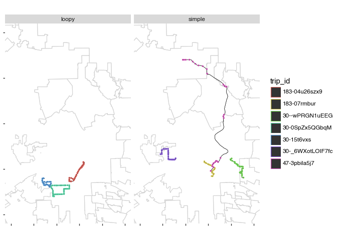
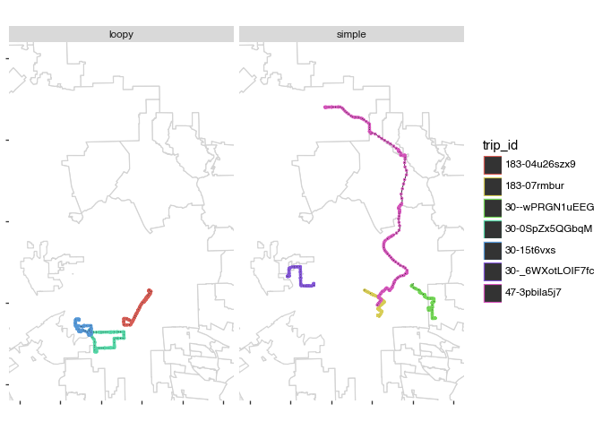

# Pre-process data


This notebook does some basic joining to GTFS data provided in
[tiffanychu90/gtfs-rt-demo](https://github.com/tiffanychu90/gtfs-rt-demo).
The results are committed to this repo as `data/1-*`.

## Setup

``` python
import polars as pl
import polars.selectors as cs
import polars_st as st
from pathlib import Path
from plotnine import *

# for geo plotting and some geo func workarounds ----
import pandas as pd
import geopandas as gpd


def from_wkb(wkb: pd.Series) -> gpd.GeoSeries:
    return gpd.GeoSeries.from_wkb(wkb)


# ----
# see https://github.com/Oreilles/polars-st/issues/1
import os
import pyproj

os.environ["PROJ_LIB"] = pyproj.datadir.get_data_dir()
# ---

DATA = Path("raw_data")
CRS = "EPSG:3310"

trip_ids_simple = ["183-07rmbur", "30--wPRGN1uEEG", "30-_6WXotLOIF7fc", "47-3pbila5j7"]
trip_ids_loopy = ["183-04u26szx9", "30-15t6vxs", "30-0SpZx5QGbqM"]

trip_types = pl.DataFrame(
    {
        "trip_id": [*trip_ids_simple, *trip_ids_loopy],
        "trip_type": ["simple"] * len(trip_ids_simple)
        + ["loopy"] * len(trip_ids_loopy),
    }
)
```

## Loading trip stops

``` python
tbl_trips = (
    pl.read_parquet(DATA / "trips_2024-10-16.parquet")
    .select("trip_id", "shape_id")
    .join(trip_types, on="trip_id")
)

tbl_trip_types = trip_types.join(tbl_trips.select("trip_id", "shape_id"), on="trip_id")


tbl_stop_times = (
    pl.read_parquet(DATA / "stop_times_2024-10-16.parquet")
    # semi-join on trips
    .join(tbl_trips, on="trip_id", how="semi")
    #
    .select("trip_id", "stop_id", "stop_sequence")
)


tbl_stops = (
    pl.read_parquet(DATA / "stops_2024-10-16.parquet")
    #
    .select("stop_id", "stop_name", "geometry")
    # semi-join on stop_times
    .join(tbl_stop_times, on="stop_id", how="semi")
    #
    .with_columns(st.geom("geometry").st.set_srid(4326).st.to_srid(3310))
    #
    .rename({"geometry": "geometry_stop"})
)

tbl_shapes = (
    pl.read_parquet(DATA / "shapes_2024-10-16.parquet")
    # semi join on trips
    .join(tbl_trips, on="shape_id", how="semi")
    #
    .select(
        "shape_id",
        pl.col("geometry").st.set_srid(4326).st.to_srid(3310).alias("geometry_shape"),
    )
)


tbl_trip_stops = (
    tbl_trips.join(tbl_stop_times, on="trip_id").join(tbl_stops, on="stop_id")
    # .join(tbl_shapes, on="shape_id")
    .sort("trip_id", "stop_sequence")
)

tbl_vp = (
    pl.read_parquet(DATA / "vp_2024-10-16.parquet")
    #
    .join(tbl_trips, "trip_id", how="semi")
    #
    .select(
        "trip_id",
        "location_timestamp_local",
        geometry_vp=pl.col("geometry").st.set_srid(4326).st.to_srid(3310),
    ).sort("trip_id", "location_timestamp_local")
)

# save to parquet ----
tbl_vp.write_parquet("data/0-vp.parquet")
tbl_trip_stops.write_parquet("data/0-trip_stops.parquet")
tbl_shapes.write_parquet("data/0-shapes.parquet")
tbl_trip_types.write_parquet("data/0-trip_types.parquet")
```

## Visualize

``` python
# load LA map ----
import geopandas as gp

df_la_map = gp.read_file(
    "data/los-angeles/admin_dist_SDE_DIST_DRP_CITY_COMM_BDY.shp"
).to_crs(CRS)

plot_geo_base = (
    #
    df_la_map
    >> ggplot()
    + geom_map(fill="white", color="lightgrey")
    + coord_fixed(xlim=[145_000, 170_000], ylim=[-450_000, -410_000])
    + geom_map(
        aes(geometry="from_wkb(geometry_shape)"),
        color="black",
        size=0.2,
        data=tbl_shapes.join(tbl_trip_types, "shape_id"),
    )
)
```

    /Users/machow/repos/2025-transit-hackathon/.venv/lib/python3.11/site-packages/pyogrio/raw.py:198: RuntimeWarning: data/los-angeles/admin_dist_SDE_DIST_DRP_CITY_COMM_BDY.shp contains polygon(s) with rings with invalid winding order. Autocorrecting them, but that shapefile should be corrected using ogr2ogr for example.

``` python
(
    plot_geo_base
    + geom_map(
        aes(geometry="from_wkb(geometry_shape)"),
        color="black",
        size=0.2,
        data=tbl_shapes.join(tbl_trip_types, "shape_id"),
    )
    + geom_map(
        aes(geometry="from_wkb(geometry_stop)", color="trip_id"), data=tbl_trip_stops
    )
    + facet_wrap("~trip_type")
    # + theme(axis_text_x=element_text(angle=45, hjust=1))
    + theme(axis_text_x=element_blank(), axis_text_y=element_blank())
)
```



``` python
import pandas as pd
import geopandas as gpd


(
    plot_geo_base
    + geom_map(
        aes(geometry="from_wkb(geometry_shape)"),
        color="black",
        size=0.2,
        data=tbl_shapes.join(tbl_trip_types, "shape_id"),
    )
    + geom_map(
        aes(geometry="from_wkb(geometry_vp)", color="trip_id"),
        data=tbl_vp.join(tbl_trip_types, "trip_id"),
    )
    + facet_wrap("~trip_type")
    # + theme(axis_text_x=element_text(angle=45, hjust=1))
    + theme(axis_text_x=element_blank(), axis_text_y=element_blank())
)
```


